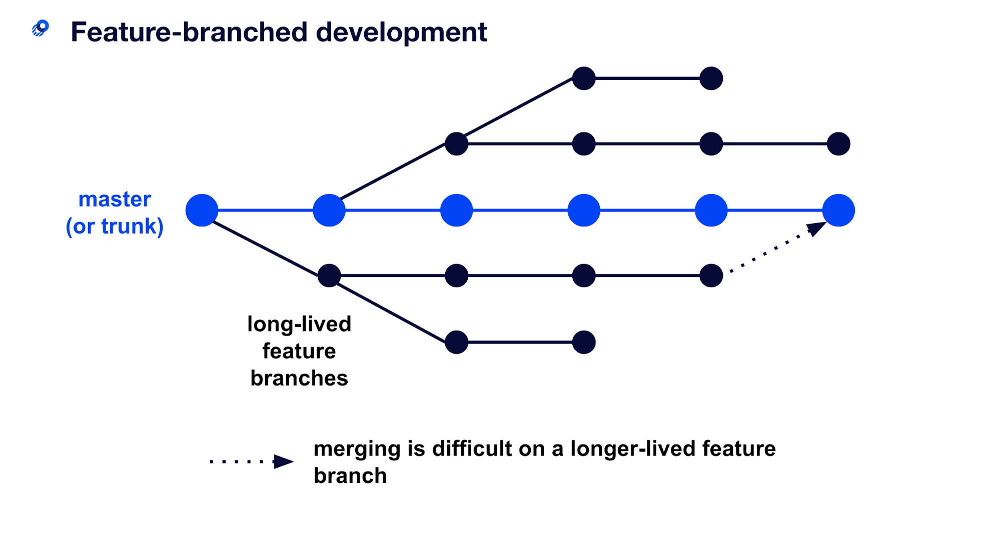

# Part 1 (Version Control)

This part is really quick, but I wanted to make sure we're all on the same page that you **need** some form of version control if you're going to be successful. And trust me, I'm **not** overexaggerating. 

Having a predefined trunk, and feature/bug branches that are PR'ed into your main branch is highly essential in making sure no unwanted features or code get out into production, because keep in mind we're using CI/CD and anything that merges to master goes to a real environment. 

[Diagram provided by optimizely.com](https://www.optimizely.com/optimization-glossary/trunk-based-development/)

Also, you'll see a `.github/` directory at the root of this repository which contains not only our CI/CD pipeline, but a `CODEOWNERS` file and a `PULL_REQUEST_TEMPLATE` which is very nice to have. This way maintainers can be added to PRs, and every PR you create has fields you just need to add text to. Its that simple :tada:

Alright, I promised this would be short. Onto the next phase -> Docker!